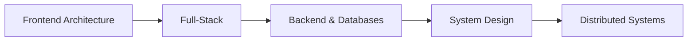

<!-- Replace every YOUR_GITHUB_USERNAME, YOUR_LINKEDIN_URL and YOUR_EMAIL below with your own values -->

# Hi, I'm Ivan Adoniev

**Frontend / Full-Stack Developer**

`React` • `TypeScript` • `Next.js` • `React Native` • `NestJS` • `PostgreSQL`

 

I build large, data-heavy web applications with a focus on clean architecture, performance and maintainable code. 
3+ years of commercial experience, now extending a strong frontend foundation into backend engineering and system design.

 

## About

- **Frontend / Full-Stack Developer** working primarily in the React, TypeScript and Node.js ecosystem
- Independently built and shipped large production applications, working directly with clients, designers and backend engineers
- Interested in how systems work under the hood — architecture, databases, performance and distributed systems — rather than just the frameworks on top
- B.Sc. in Computer Science, Donetsk National University (2019–2023)

 

## Tech Stack

### Core

 
 

<table align="center">
  <tr>
    <td valign="top" width="25%">
      <b>Frontend</b>
        
      
        
      
      
      
      
      
    </td>
    <td valign="top" width="25%">
      <b>UI &amp; Styling</b>
        
      
        
      
      
      
      
    </td>
    <td valign="top" width="25%">
      <b>Backend &amp; Data</b>
        
      
        
      
      
      
    </td>
    <td valign="top" width="25%">
      <b>Infrastructure &amp; Tools</b>
        
      
        
      
      
      
    </td>
  </tr>
</table>

 

## What I Work On

| Area | Experience |
| --- | --- |
| **Complex frontends** | Large production CRM systems, data-heavy dashboards, charts and analytics, complex multi-step forms |
| **Visual tooling** | Workflow and visual builders, node-based editors, drag-and-drop email builders |
| **Architecture** | Reusable frontend architecture, shared component systems, performance optimization |
| **Mobile** | React Native applications |
| **Backend** | NestJS services, REST API design and integration, PostgreSQL schema design, Redis caching and state |
| **Developer environment** | Dockerized local development, monorepo tooling |

 

## Engineering Focus

Having built a solid foundation in frontend architecture, I'm expanding into the rest of the stack — designing services and data models, not just consuming them.

**Currently deepening:** backend architecture with NestJS, PostgreSQL internals and query design, Redis, Docker and system design.

**Exploring next:** distributed systems, high-load architecture, microservices, CI/CD and cloud infrastructure.

 

## GitHub Stats

 

 

## Activity

 

## Connect With Me

 
 

Open to conversations about full-stack engineering, frontend architecture and interesting product challenges.

